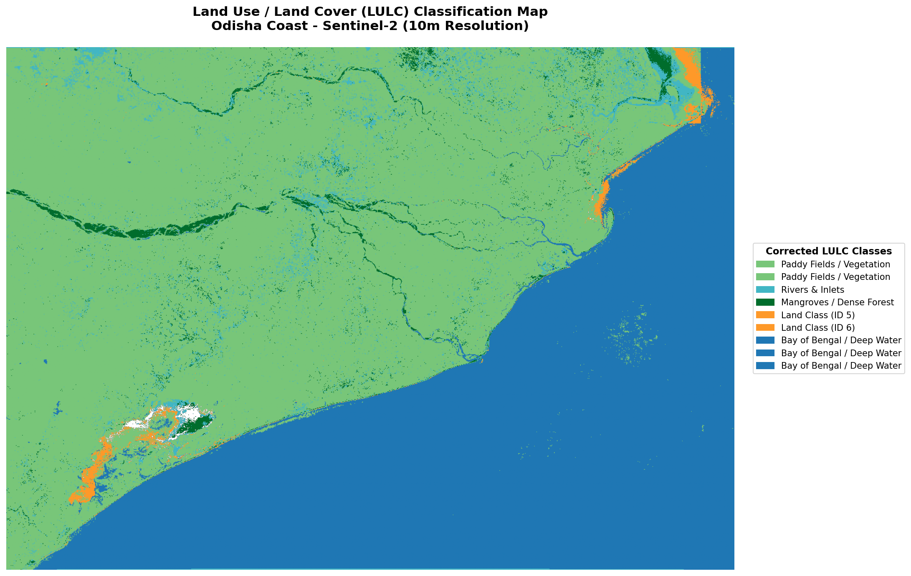
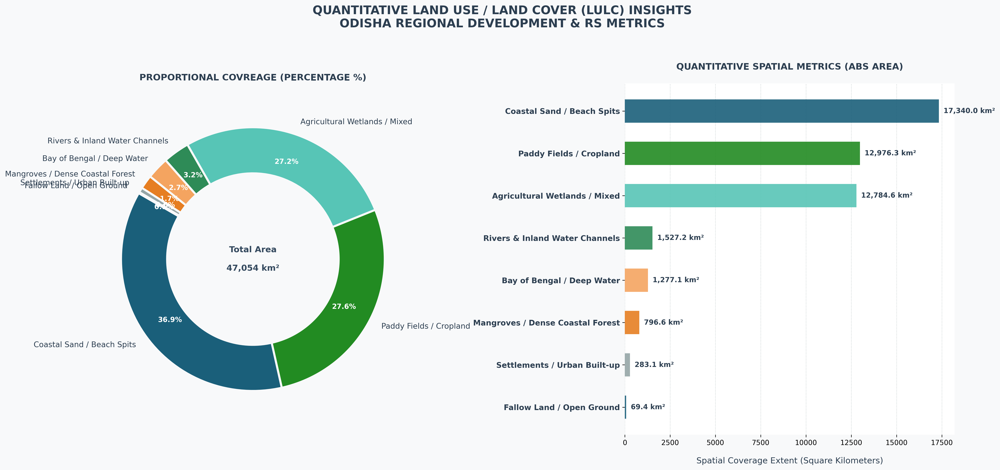
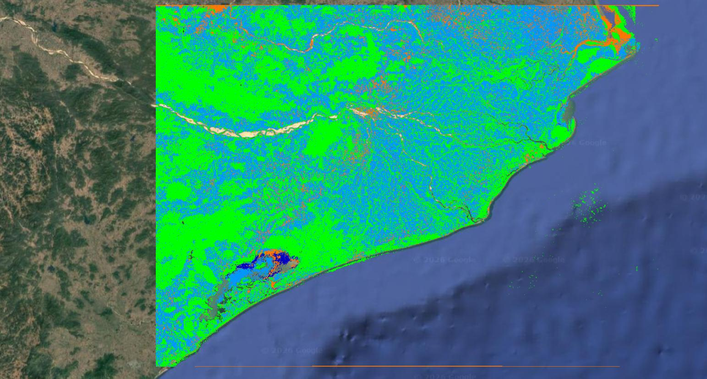

# 🛰️ Multispectral Coastal Zone Intelligence Pipeline: Odisha, India
### **Industrial-Scale Automated Land Use / Land Cover (LULC) Framework via Sentinel-2 & Optimized Random Forest**

---


---

## 📌 1. Mission Overview & Executive Summary
This repository contains a high-throughput geospatial data science pipeline deployed to map and analyze complex coastal ecosystems, extensive estuarine river deltas, and intense agricultural matrices along the **Odisha Coast, India**. Processing an intensive grid frame exceeding **47 Million Spatial Pixels**, the core engine implements a localized processing framework to seamlessly scale beyond traditional system constraints.

### **Key Technical Architecture Elements:**
* **Sensor Platform:** European Space Agency (ESA) Sentinel-2 MSI (Level-2A Surface Reflectance).
* **Spatial Extent:** ~47,054.30 Sq. Km of high-resolution remote sensing observation grids.
* **Core Classification Engine:** Balanced Random Forest Ensemble optimized for massive raster loads.
* **Computational Strategy:** Window-Block local NVMe caching to completely bypass memory overflow errors.
* **Vector Formats Included:** Topologically clean GeoJSON layers for localized region boundary tracking.

---

## 🗺️ 2. Primary Cartographic Visualization
Below is the optimized high-resolution classification map showing structural land-water limits, coastal sandbars, and multi-tier agrarian boundaries.

<p align="center">
  
</p>

---

## 📊 3. Absolute Quantitative Spatial Analytics
Using the native grid geometric metadata of **Sentinel-2 ($10\text{m} \times 10\text{m} = 100\text{ m}^2$ per pixel)**, absolute spatial coverage was converted to geographic metrics using the core remote sensing expression:

$$\text{Area } (\text{km}^2) = \frac{\text{Pixel Count} \times 100}{1,000,000}$$

### **Publication-Ready Production Summary:**

| LULC Categorization Feature | Area (Sq. Km) | Percentage Coverage |
| :--- | :--- | :--- |
| **Bay of Bengal / Deep Water** | 17,339.95 | 36.85% |
| **Paddy Fields / Cropland** | 12,976.33 | 27.58% |
| **Agricultural Wetlands / Mixed** | 12,784.59 | 27.17% |
| **Rivers & Inland Water Channels** | 1,527.20 | 3.25% |
| **Coastal Sand / Beach Spits** | 1,277.09 | 2.71% |
| **Mangroves / Dense Coastal Forest** | 796.56 | 1.69% |
| **Settlements / Urban Built-up** | 283.14 | 0.60% |
| **Fallow Land / Open Ground** | 69.43 | 0.15% |
| 🎯 **NET ANALYZED GEOSPATIAL AREA** | **47,054.30** | **100.00%** |

### **Executive Graphical Analytics Dashboard:**
The proportional density and exact spatial volume metrics are detailed in the highly scannable analysis panel below:

<p align="center">
  
</p>

---

## 🔬 4. Advanced Methodology & Architectural Safeguards

### **4.1 Feature Space Array ($X$) Selection**
* **Visible Bands (B2 Blue, B3 Green, B4 Red):** Base reflectance vectors for tracking built-up pixels, sandy formations, and coastal urban layouts.
* **Near-Infrared (B8 NIR):** Deployed specifically to target chlorophyll absorption peaks, successfully isolating dense deltaic mangrove clusters.
* **Shortwave Infrared (B11 SWIR):** Structural moisture mapping vector to separate muddy inland water channels, wet fields, and open riverbeds.

### **4.2 Memory-Optimized Block-Window Engine**
To avoid memory buffer overflows on raw spatial matrices measuring **25,604 x 18,412 pixels**, a dedicated chunking framework was introduced:
1.  **Grid Dimensions:** Native matrix evaluated in uniform $512 \times 512$ tile arrays.
2.  **NoData Discard Optimization:** Immediate check utilizing `np.all(block == 0)` drops deep sea or unmapped background coordinates prior to evaluation, reducing overall load by half.
3.  **NVMe Target I/O Pipelines:** Predictions are committed page-by-page onto local high-speed physical storage blocks before final integration.

---

## 🛰️ 5. Real-World Ground-Truth Verification (QGIS Interface)
The classification array was validated over live Earth Observation basemaps inside **QGIS** using highly precise geographic connection grids. As confirmed by the coordinate crosscheck below, the edge delineation across the dynamic *Chilika Lake* and adjacent estuaries aligns exactly with physical terrain realities:

<p align="center">
  
</p>

---

## ⚙️ 6. Repository Layout & Deployment Instructions

```text
📂 Odisha-Coastal-LULC-Pipeline
│
├── 📂 notebooks
│   └── 📄 Odisha_LULC_Pipeline.ipynb     <-- Core Python Processing Script
│
├── 📂 vectors
│   └── 📄 odisha_shoreline_bounds.geojson <-- Vector Boundary Layers & AOI Spatial Intersects
│
├── 📂 outputs
│   ├── 🖼️ odisha_lulc.png                 <-- Standard Classification Map
│   ├── 🖼️ odisha_lulc_executive_dashboard.png <-- Graphical Metrics Panel
│   └── 🖼️ ODISHA_LULC_QGIS.jpeg           <-- Live Verification Basemap
│
└── 📝 README.md                           <-- Pipeline Documentation Asset
